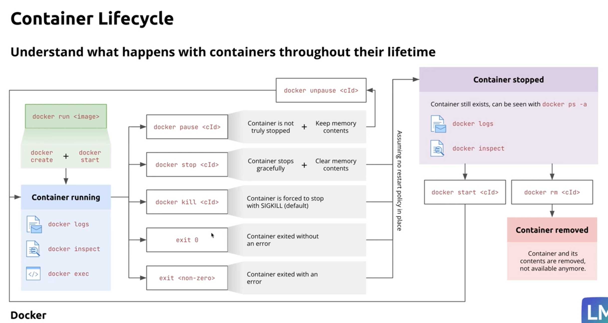

# docker-and-kubernetes-learning
Notes and codes from the Coursera course 

## Installing Docker

## Running containers

nginx is a web server:
https://hub.docker.com/_/nginx

--> `docker pull nginx`
`docker run nginx`

`docker ps` shows the Docker processes currently running

`docker run -d nginx` --> Starts container in detached mode, then the next line is the process hash which will match what you see with `docker ps`
Docker also gives running processes a more human-readable name, e.g. "boring_hoover". They can be killed using this name:
`docker kill boring_hoover`

`docker run -d -p 8080:80 --name web-server nginx`
`-p 8080:80`: This maps port 8080 on our local machine to port 80 of the container. If we issue an https request on 8080, this is mapped to the container port 80 and we should get a response.
`--name`: This allows us to explicitly name our container process.

We can check this is working by running `curl http://localhost:8080` or by visiting this address in our browser.

`docker stop <name>` will stop a container _gracefully_, whereas `docker kill <name>` will do it _forcefully_. "Stop" is the preferred version!

## Containers lifecycle

## Docker CLI

`docker images`: shows all images we have stored locally.
`docker ps -a`: Shows all Docker processes, including stopped ones.
`docker rmi <image name>`: Removes the specified (local) Docker images

Docker creates a new container every time `docker run` is called. To restart a specific container, use the command `docker start <cid>` where `cid` is the container ID (visible in `docker ps -a`). If you passed a name to the original `docker run` command, you can use that instead of the `cid`.

`docker rm <cid | name>` will remove the specified container. This frees up the resources used by that container. You can remove multiply containers simultaneously by passing a space-separated list of cids or names.

`docker ps -a | grep <name>` to search for a specific named container. You can also acheive this with `docker ps --filter name=<name>`

`docker ps -q` will return a list of all running container IDs. Including `-a` will return _all_ IDs, including stopped containers.

To stop all running containers you can therefore do `docker stop $(docker ps -q)` which effectively pipes all running IDs to the `docker stop` command. 

`docker logs <cid|name>` shows the logs of the specified container. Adding the `-f` ("follow") flag continues to show updates to the logs in real time.

`docker exec -it <cid|name> sh` will open an interactive shell in the specified container (can also use `/bin/bash` instead of `sh`). Exit this shell with `exit`.

`docker build <target directory>` will build an image defined in the Dockerfile in \<target directory\>. See for example "my-first-dockerfile/". We can add many commands and customisations into the Dockerfile.

`docker --help` displays the help. Useful! Can append `--help` to any given Docker command to see detailed help.

## Customising NGINX

`docker pull nginx:1.27.0` to pull this specific version of nginx to my local machine.

`docker run -d -p 80:80 --name web_server nginx:1.27.0`: start a container with these properties.

`docker exec -it web_server sh`: begin an interactive shell in this container.
--> `apt-get update`
--> `apt-get install vim`
Then user vim to modify /usr/share/nginx/html/index.html

Manual editing is not a scalable approach. If the container disappears, we lose all the changes we made. Storage is by definition ephemeral -- we need a better way of handling persistent storage.

DOcker volumes are the mechanism for persisting data generated and used by Docker containers, stored on the host machines filesystem. These are created by mounting it to a specific directory inside the container. This can be done at runtime, with `docker run -v <volume-name>:<container/path/to/volume> ...` where we spcify the name of the volume and the mount point within the container. This will persist after the container is stopped. For example:
`docker run -d -p 80:80 --name web_server -v web_server_volume:/user/share/nginx/html nginx:1.27.0`

Locally, the volume info can be found by `docker volume inspect <volume-name>` which returns a JSON with its attributes.

To remove a volume from the host, run `docker volume rm <volume-name>`
To display all volumes on the host, `docker volume ls`

## Working with images

Docker images are the DNA or blueprint of a container.

- Base layer: often a minimal Linux distribution like Alpine, or more fully fledged like Ubuntu
- Runtime Environment: Specific software (e.g. Python, NodeJS) required by the application
- Libraries and dependencies: All the external code the application relies on
- Application Code: Soruce code or compiled binaries of the application
- Configuration: Settings for the application and environment

Images are like a snapshot of the application and its complete runtime environment.

Images can be sourced from multiple locations:

- Docker Hub
- Private registries (for e.g. proprietary software)
- Building your own images by writing Dockerfiles

### Container registries

Benefits:

- Collaboration
- Versioning
- Security: private registries provide a secure environment for storing images.
- Automation: automate image building and deployment as part of your CI/CD pipeline